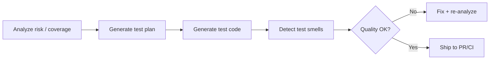

# QA Skills for Coding Agents

A practical QA skill pack for Claude Code, Codex, Gemini CLI, OpenCode, and similar coding agents.

This repository ships **9 skills**:
- **4 generators** for scaffolding test suites, scenarios, and plans
- **3 analyzers** for detecting issues, gaps, and risks
- **1 input tester** for boundary and edge case generation
- **1 security tester** for OWASP-based security test cases

## Design Principles

- **Native frameworks only** — Tests are written using the project's own test framework (pytest, vitest, JUnit, go test). No intermediate tools like Postman, Karate, or SoapUI.
- **Playwright-exclusive for E2E** — All browser testing uses the Playwright ecosystem (Playwright Test, CLI codegen, MCP, Trace Viewer). No Selenium or Cypress.
- **Code-first** — Everything is version-controlled, CI-friendly test code. No GUI-dependent workflows.

## Quick Install

### Claude Code Plugin Marketplace

```bash
/plugin marketplace add umitozdemirf/qa-skills
/plugin install qa-skills@umitozdemirf
```

### Team Rollout

Add this to project-level `.claude/settings.json`:

```json
{
  "extraKnownMarketplaces": {
    "qa-skills": {
      "source": {
        "source": "github",
        "repo": "umitozdemirf/qa-skills"
      }
    }
  }
}
```

### One-Command Installer

For local project setup across supported agents:

```bash
./scripts/install_integrations.sh all --project "$(pwd)"
```

## Cross-Agent Install

This repo now supports three integration modes:

- **Native Claude Code plugin** via marketplace install
- **AGENTS.md-based integration** for Codex/OpenCode-style agents
- **Command-pack / prompt-pack export** for Claude Code, Gemini CLI, and OpenCode

### Claude Code

Primary path: install the plugin from the marketplace.

Alternative path: use the installer to place slash commands into a project or user command directory.

```bash
./scripts/install_integrations.sh claude --project "$(pwd)"
```

This gives you commands like `/qa:api-test-generator` and `/qa:risk-analyzer`.

### Codex

Codex works best here through the repository-level [AGENTS.md](./AGENTS.md). Keep this repo checked out inside the project, or vendor the `AGENTS.md` plus `qa-skills-plugin/skills/` tree into a location your project instructions can reference.

Recommended project layout:

```text
your-project/
├── AGENTS.md
└── tools/
    └── qa-skills/
        ├── AGENTS.md
        └── qa-skills-plugin/skills/
```

Minimal install flow:

```bash
./scripts/install_integrations.sh codex --project "$(pwd)"
```

This installs the QA skill pack under `tools/qa-skills/` and creates a minimal root `AGENTS.md` if one does not already exist.

### Gemini CLI

Install Gemini command wrappers with:

```bash
./scripts/install_integrations.sh gemini --project "$(pwd)"
```

This gives you commands like `/qa:security-test-generator`.

### OpenCode

Install OpenCode command wrappers with:

```bash
./scripts/install_integrations.sh opencode --project "$(pwd)"
```

If your OpenCode setup uses `.opencode/command/` instead of `.opencode/commands/`, copy the same `qa/` folder there instead.

### Install Everything

```bash
./scripts/install_integrations.sh all --project "$(pwd)"
```

### Home Directory Install

```bash
./scripts/install_integrations.sh claude --home
./scripts/install_integrations.sh gemini --home
./scripts/install_integrations.sh opencode --home
./scripts/install_integrations.sh codex --home
```

### Regenerate Exports

```bash
python3 scripts/export_agent_commands.py
./scripts/package_integrations.sh
```

## How People Use This Repo

Most workflows are generator + analyzer loops.



Typical prompts:

```text
Use api-test-generator to create pytest tests for all endpoints in src/api/
Generate service test scenarios from our swagger.json for the order flow.
Analyze risk for this PR and suggest what to test first.
Use security-test-generator to create OWASP test cases for the auth module.
Run test-smell-detector on tests/ and fix any critical issues.
Generate a test plan for the checkout feature with risk-based prioritization.
```

## Skill Catalog (9)

### Test Generation (4)

| Skill | Primary use |
|---|---|
| `api-test-generator` | Generate API test suites using native test frameworks (pytest+httpx, vitest+supertest, JUnit+REST-assured, go test) |
| `service-test-generator` | Generate multi-step scenario tests from OpenAPI/Swagger specs — CRUD lifecycles, auth flows, cross-resource chains |
| `e2e-test-generator` | Generate Playwright E2E tests with POM, codegen, API testing, and trace support |
| `test-plan-generator` | Generate risk-prioritized test plans for features, PRs, or releases |

### Analysis and Detection (3)

| Skill | Primary use |
|---|---|
| `test-smell-detector` | Detect test anti-patterns, flaky indicators, and maintainability issues |
| `test-coverage-analyzer` | Identify untested code paths, missing edge cases, and coverage gaps |
| `risk-analyzer` | Score change risk, map blast radius, identify fragile areas, prioritize testing |

### Specialized Testing (2)

| Skill | Primary use |
|---|---|
| `input-validation-tester` | Generate boundary value, equivalence partitioning, and edge case test data |
| `security-test-generator` | Generate OWASP Top 10 security test cases for web apps and APIs |

## Supported Frameworks

### API Testing
| Language | Framework | HTTP Client |
|---|---|---|
| Python | pytest | httpx, requests |
| JavaScript/TypeScript | vitest, jest | supertest, fetch |
| Java | JUnit 5 | REST-assured, WebTestClient |
| Go | go test | net/http/httptest |

### E2E Testing
| Capability | Tool |
|---|---|
| Browser testing | Playwright Test |
| Test recording | Playwright CLI codegen |
| API within E2E | Playwright request context |
| Component testing | Playwright experimental CT |
| Debugging | Playwright Trace Viewer, UI Mode |
| AI-assisted | Playwright MCP |

## Repo Layout

```text
qa-skills/
├── AGENTS.md
├── .github/workflows/validate.yml
├── README.md
├── LICENSE
├── .gitignore
├── scripts/
│   ├── export_agent_commands.py
│   ├── install_integrations.sh
│   ├── package_integrations.sh
│   └── validate_skills.py
├── integrations/
│   ├── claude/
│   ├── gemini/
│   ├── opencode/
│   └── README.md
├── .claude-plugin/
│   └── marketplace.json
└── qa-skills-plugin/
    ├── .claude-plugin/plugin.json
    └── skills/
        └── <skill-name>/
            ├── SKILL.md
            ├── references/
            ├── scripts/        # optional
            ├── examples/       # optional
            ├── test/           # optional
            └── assets/         # optional
```

## Requirements

### Baseline
- `bash`
- `python3` (3.9+ recommended)
- `node` (18+ for Playwright)

### By Domain
| Domain | Tools |
|---|---|
| API testing (Python) | `pytest`, `httpx`, `faker` |
| API testing (JS/TS) | `vitest` or `jest`, `supertest` |
| E2E testing | `@playwright/test`, Playwright browsers |
| Security testing | Application under test, `curl` |
| Coverage | `pytest-cov`, `c8`/`istanbul`, `jacoco` |

### Quick Install (macOS)

```bash
# Python API testing
pip install pytest httpx pytest-cov faker

# Node.js API testing
npm install -D vitest supertest

# Playwright E2E
npm init playwright@latest
npx playwright install

# All-in-one
brew install python node
```

## Contributing

Contributions are welcome for:
- New skills in adjacent QA domains (accessibility, contract testing, performance)
- Better reference coverage and examples
- Scripts for automated detection and analysis
- CI integration examples

## Examples

Example outputs are now included for high-value skills:

- [api-test-generator example](/Users/umitozdemir/proj/hepapi/qa-skills/qa-skills-plugin/skills/api-test-generator/examples/fastapi-users-pytest.md)
- [service-test-generator example](/Users/umitozdemir/proj/hepapi/qa-skills/qa-skills-plugin/skills/service-test-generator/examples/order-lifecycle-flow.md)
- [e2e-test-generator example](/Users/umitozdemir/proj/hepapi/qa-skills/qa-skills-plugin/skills/e2e-test-generator/examples/login-flow-playwright.md)
- [input-validation-tester example](/Users/umitozdemir/proj/hepapi/qa-skills/qa-skills-plugin/skills/input-validation-tester/examples/signup-form-boundary-cases.md)
- [test-plan-generator example](/Users/umitozdemir/proj/hepapi/qa-skills/qa-skills-plugin/skills/test-plan-generator/examples/checkout-feature-test-plan.md)
- [risk-analyzer example](/Users/umitozdemir/proj/hepapi/qa-skills/qa-skills-plugin/skills/risk-analyzer/examples/pr-risk-report.md)
- [security-test-generator example](/Users/umitozdemir/proj/hepapi/qa-skills/qa-skills-plugin/skills/security-test-generator/examples/auth-api-security-cases.md)
- [test-coverage-analyzer example](/Users/umitozdemir/proj/hepapi/qa-skills/qa-skills-plugin/skills/test-coverage-analyzer/examples/coverage-gap-report.md)
- [test-smell-detector example](/Users/umitozdemir/proj/hepapi/qa-skills/qa-skills-plugin/skills/test-smell-detector/examples/test-smell-report.md)

## Validation

Validate the skill pack and regenerate cross-agent command wrappers with:

```bash
python3 scripts/validate_skills.py
python3 scripts/export_agent_commands.py
./scripts/package_integrations.sh
```

## Agent Compatibility Notes

- `Claude Code`: native plugin install remains the cleanest path; exported slash commands are useful when you want local project commands instead.
- `Codex`: this repo ships a root `AGENTS.md` so the skill catalog can be consumed as project instructions.
- `Gemini CLI`: wrappers are exported as TOML command files under `integrations/gemini/`.
- `OpenCode`: wrappers are exported as markdown command files under `integrations/opencode/`.

## Source Links

- [Claude Code slash commands](https://docs.anthropic.com/en/docs/claude-code/slash-commands)
- [OpenAI Codex repository](https://github.com/openai/codex)
- [Gemini CLI custom commands](https://google-gemini.github.io/gemini-cli/docs/cli/commands/)
- [OpenCode commands](https://opencode.ai/docs/commands/)

## License

Apache-2.0
